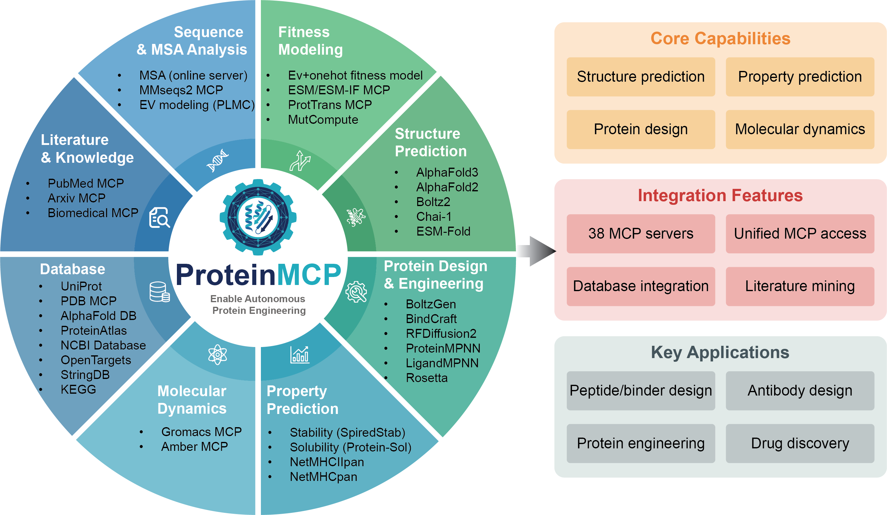

# ProteinMCP: An Agentic AI Framework for Autonomous Protein Engineering


## Install:
```shell
mamba env create -f environment.yml
mamba activate protein-mcp
pip install -r requirements.txt

# Install claude code
npm install -g @anthropic-ai/claude-code

pip install -e .
```
## Supported MCPS:

Please find the 38 supported MCPS in [the MCP list](./tool-mcps/README.md).

## Usage:
```shell
# List all MCPs
pmcp list

# List only local MCPs
pmcp list --local

# Search for MCPs
pmcp search protein

# Show MCP details
pmcp info interpro

# Install an MCP
pmcp install proteinmpnn

# Create a new MCP from a repository
pmcp create --github-url https://github.com/user/repo --mcp-dir /path/to/mcp

# Uninstall an MCP
pmcp uninstall arxiv
```

### Create a MCP from github repository
```shell
pmcp create --github-url https://github.com/jwohlwend/boltz --mcp-dir tool-mcps/boltz_mcp --use-case-filter 'structure prediction with boltz2, affinity prediciton with boltz2, batch structure prediction for protein variants given prepared configs'
```

### Create a MCP from local code repository
```shell
pmcp create --local-repo-path /opt/rosetta/rosetta.binary.ubuntu.release-371/main/ --mcp-dir tool-mcps/rosetta_mcp --use-case-filter 'Membrane protein structure prediction, Loop modeling, Enzyme design, Protein Design with non-canonical amino acids, Protein-protein docking, Ligand docking, Antibody-antigen docking (SnugDock), Symmetric docking, RNA design, RNA-protein complex prediction, CDR loop modeling, Antibody design, Relax, Structure quality analysis, Clustering, Covalent docking, Ligand design, Peptide modeling, Symmetric assembly modeling, Membrane protein design, Multi-state design, ddG calculations, NMR-guided modeling, Cryo-EM refinement, Comparative modeling'
```

### Install a MCP
```shell
python src/install_mcp.py list                     # List all MCPs (fast, uses cache)
python src/install_mcp.py list --refresh           # Refresh status cache (slower, but accurate)

python src/install_mcp.py install uniprot           # Install Uniprot MCP from Augmented Nature
python src/install_mcp.py install proteinmpnn       # Install a MPC in ProteinMCP project
```

**Performance Note:** The `list` command uses status caching to avoid repetitive CLI checks. Status is cached for 5 minutes in `tool-mcps/mcp.status`. Use `--refresh` to force update.

## Demo cases:
``` /home/xux/Desktop/ProteinMCP/ProteinMCP/
  ├── .claude/
  │   ├── skills/
  │   │   └── fitness-modeling/
  │   │       └── SKILL.md              ← Auto-discovered skill
  │   └── commands/
  │       └── fitness-model.md          ← Slash command /fitness-model
  └── workflow-skills/
      └── fitness_modeling_skill.md     ← Original reference file
```
### Protein sequence analysis

### Protein structural analysis

### Train and compare protein fitness models on a dataset


### Desing a binder to bind target protein

### Design a SARS-COV-2 nanobody


## Licences
This software is open-sourced under [](./LICENSE)
