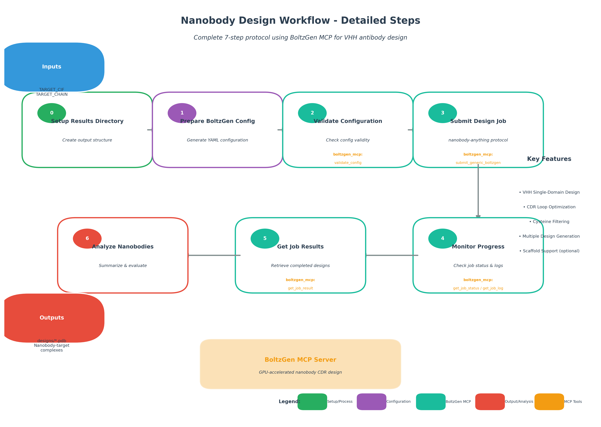

# Workflow Figures

This directory contains figure generation scripts and outputs for protein design workflow documentation.

---

## Nanobody Design Workflow

### Main Figure

**File:** `nanobody_design_main.png` / `nanobody_design_main.pdf`

**Purpose:** High-level workflow overview for the main manuscript. Shows the conceptual flow from target structure to designed nanobodies.


**Components:**
- **Target Structure** (blue) - Input CIF/PDB file with target protein
- **Configuration** (purple) - YAML configuration for BoltzGen
- **BoltzGen MCP** (teal) - Core design engine using nanobody-anything protocol
- **CDR Design** (green) - Cysteine-filtered CDR loop optimization
- **Nanobodies** (red) - Output PDB structures of designed nanobody-target complexes

**Key Features Highlighted:**
- VHH Single-Domain antibody design
- CDR Loop Optimization
- Cysteine Filtering for improved folding
- Multiple Design Generation

---

### Supplementary Figure

**File:** `nanobody_design_supplementary.png` / `nanobody_design_supplementary.pdf`

**Purpose:** Detailed step-by-step workflow for supplementary information. Shows all 7 steps with MCP tool specifications.



**Workflow Steps:**

| Step | Name | Description | MCP Tool |
|------|------|-------------|----------|
| 0 | Setup Results Directory | Create output structure | - |
| 1 | Prepare BoltzGen Config | Generate YAML configuration | - |
| 2 | Validate Configuration | Check config validity | `boltzgen_mcp:validate_config` |
| 3 | Submit Design Job | nanobody-anything protocol | `boltzgen_mcp:submit_generic_boltzgen` |
| 4 | Monitor Progress | Check job status & logs | `boltzgen_mcp:get_job_status/get_job_log` |
| 5 | Get Job Results | Retrieve completed designs | `boltzgen_mcp:get_job_result` |
| 6 | Analyze Nanobodies | Summarize & evaluate | - |

**Inputs:**
- `TARGET_CIF` - Target protein structure (CIF/PDB format)
- `TARGET_CHAIN` - Chain ID to design nanobody against

**Outputs:**
- `designs/*.pdb` - Nanobody-target complex structures

---

## Regenerating Figures

To regenerate the nanobody design figures:

```bash
python workflow-skills/figures/nanobody_design_figures.py
```

**Requirements:**
- Python 3.8+
- matplotlib
- numpy

---

## Figure Style Guide

All figures follow a consistent style:

### Color Palette

| Element | Color | Hex Code |
|---------|-------|----------|
| Input | Blue | `#3498db` |
| Configuration | Purple | `#9b59b6` |
| Process | Green | `#27ae60` |
| Output | Red | `#e74c3c` |
| MCP Tools | Orange | `#f39c12` |
| BoltzGen | Teal | `#1abc9c` |
| Text | Dark Gray | `#2c3e50` |

### Output Formats

- **PNG** - 300 DPI raster format for web/presentations
- **PDF** - Vector format for publications

---

## Binder Design Workflow

### Workflow Overview Figure

**File:** `binder_workflow_overview.png` / `binder_workflow_overview.pdf`

**Purpose:** Schematic diagram of the BindCraft pipeline for the main manuscript.


**Pipeline Components:**
1. **Target PDB** (blue) - Input protein structure
2. **Config Generation** (purple) - Settings and parameters
3. **BindCraft MCP** (orange box) - Core design pipeline containing:
   - **RFdiffusion** (green) - Backbone structure generation
   - **ProteinMPNN** (teal) - Sequence design
   - **AlphaFold2** (blue) - Structure validation
4. **Output** - PDB structures, quality metrics, analysis figures

### Quality Assessment Figures

**Main Figure:** `binder_design_main.png/pdf` (generated with results data)
- Panel A: pLDDT distribution across designs
- Panel B: pAE comparison with thresholds
- Panel C: Interface score ranking
- Panel D: pTM scores

**Supplementary Figure:** `binder_design_supplementary.png/pdf` (generated with results data)
- Panel A: Normalized quality metrics heatmap
- Panel B: Interface analysis scatter plot
- Panel C: Composite quality score distribution
- Panel D: Design selection summary

### Regenerating Figures

```bash
# Workflow overview only (no data needed)
python workflow-skills/figures/binder_design_figures.py --workflow-only

# All figures with results data
python workflow-skills/figures/binder_design_figures.py --results_dir /path/to/results

# Specific figures
python workflow-skills/figures/binder_design_figures.py --main-only --results_dir /path/to/results
python workflow-skills/figures/binder_design_figures.py --supplementary-only --results_dir /path/to/results
```

---

## Regenerating All Figures

```bash
# Nanobody design figures
python workflow-skills/figures/nanobody_design_figures.py

# Binder design workflow overview
python workflow-skills/figures/binder_design_figures.py --workflow-only

# Binder design quality figures (requires results data)
python workflow-skills/figures/binder_design_figures.py --results_dir /path/to/results
```

**Requirements:**
- Python 3.8+
- matplotlib
- numpy
- pandas (for binder design quality figures)

---

## Figure Style Guide

All figures follow a consistent style:

### Color Palette

| Element | Color | Hex Code |
|---------|-------|----------|
| Input | Blue | `#3498db` |
| Configuration | Purple | `#9b59b6` |
| Process/Success | Green | `#27ae60` / `#2ecc71` |
| Output/Warning | Red | `#e74c3c` |
| MCP Tools | Orange | `#f39c12` |
| BoltzGen/Teal | Teal | `#1abc9c` |
| Text | Dark Gray | `#2c3e50` |

### Output Formats

- **PNG** - 300 DPI raster format for web/presentations
- **PDF** - Vector format for publications

---

## Adding New Workflow Figures

When creating figures for a new workflow, follow this structure:

1. Create `{workflow}_figures.py` in this directory
2. Implement functions:
   - `create_main_figure()` - High-level overview for main text
   - `create_supplementary_figure()` - Detailed steps for SI
   - `create_workflow_figure()` - Pipeline schematic (optional)
3. Use the shared color palette and style functions
4. Output both PNG and PDF formats
5. Add CLI arguments for flexibility (`--workflow-only`, `--results_dir`, etc.)
