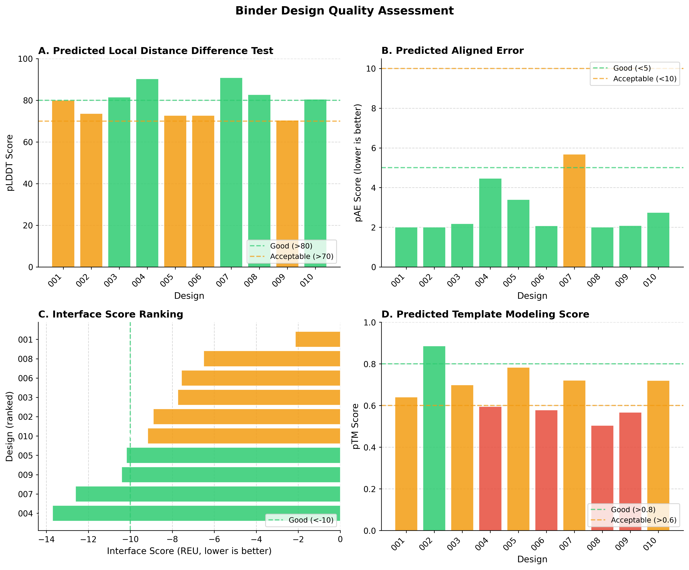
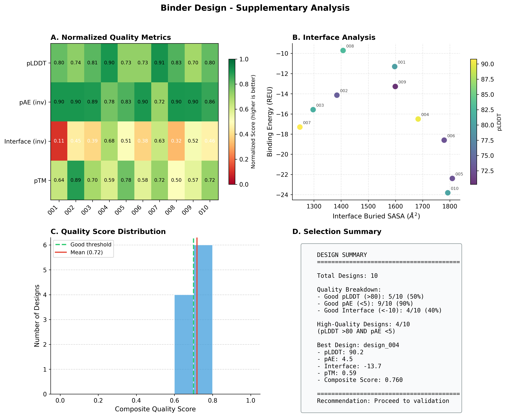
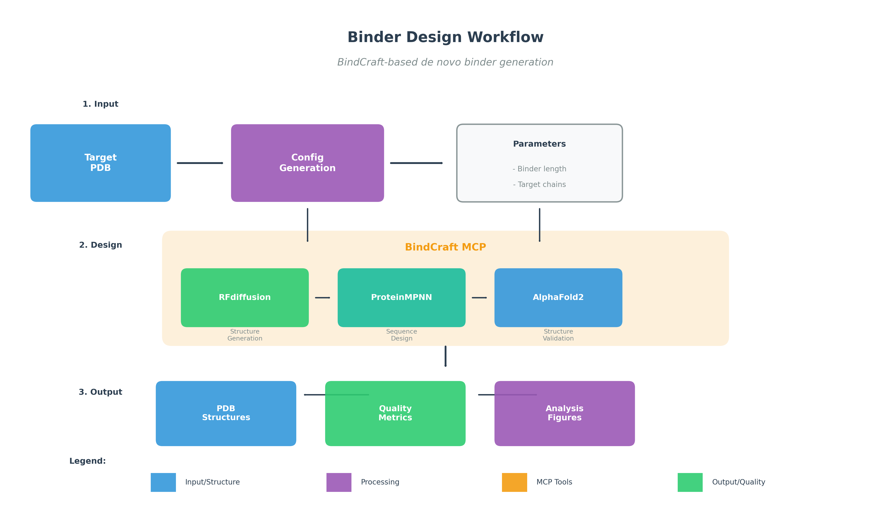

# Binder Design Workflow Figures

This document showcases the publication-ready figures generated for the Binder Design workflow using BindCraft.

---

## Main Figure: Binder Design Quality Assessment



**Figure 1. Multi-panel quality assessment of designed protein binders.**

This figure provides a comprehensive overview of binder design quality metrics:

| Panel | Metric | Description | Quality Thresholds |
|-------|--------|-------------|-------------------|
| **A** | pLDDT | Predicted Local Distance Difference Test - measures per-residue confidence | Good: >80, Acceptable: >70 |
| **B** | pAE | Predicted Aligned Error - measures inter-domain accuracy | Good: <5, Acceptable: <10 |
| **C** | Interface Score | Rosetta Energy Units (REU) - measures binding interface quality | Good: <-10 (more negative = better) |
| **D** | pTM | Predicted Template Modeling score - measures overall structural confidence | Good: >0.8, Acceptable: >0.6 |

**Color coding:**
- 🟢 **Green**: Good quality (meets optimal threshold)
- 🟠 **Orange**: Acceptable quality (meets minimum threshold)
- 🔴 **Red**: Below threshold (may need redesign)

---

## Supplementary Figure: Detailed Analysis



**Figure S1. Detailed per-design analysis and quality correlations.**

This supplementary figure provides deeper insights into design quality:

### Panel A: Normalized Quality Metrics Heatmap
- All metrics normalized to 0-1 scale (higher = better)
- Inverted metrics (pAE, Interface) shown as `(inv)` for consistent interpretation
- Enables quick visual comparison across all designs and metrics

### Panel B: Interface Analysis
- Scatter plot of Interface Buried SASA vs Binding Energy
- Points colored by pLDDT score
- Identifies designs with optimal binding characteristics
- Labels indicate design IDs for easy reference

### Panel C: Quality Score Distribution
- Histogram of composite quality scores
- Composite score = weighted average:
  - 30% pLDDT (normalized)
  - 30% pAE (inverted, normalized)
  - 20% Interface score (inverted, normalized)
  - 20% pTM
- Dashed green line: Good threshold (0.7)
- Solid red line: Mean score across designs

### Panel D: Selection Summary
- Total design count and quality breakdown
- Percentage meeting each quality threshold
- High-quality design count (meeting both pLDDT and pAE thresholds)
- Best design identification with all metrics
- Recommendation for next steps

---

## Workflow Overview: BindCraft Pipeline



**Figure 2. Schematic overview of the BindCraft-based binder design workflow.**

The workflow consists of three main stages:

### 1. Input Stage
| Component | Description |
|-----------|-------------|
| **Target PDB** | Input protein structure file containing the target for binder design |
| **Config Generation** | Automated configuration based on target analysis |
| **Parameters** | User-specified settings (binder length, target chains, hotspots) |

### 2. Design Stage (BindCraft MCP)
The core design pipeline integrates three state-of-the-art tools:

| Tool | Function | Output |
|------|----------|--------|
| **RFdiffusion** | Structure Generation | De novo backbone generation for binder scaffold |
| **ProteinMPNN** | Sequence Design | Optimized amino acid sequences for generated structures |
| **AlphaFold2** | Structure Validation | Confidence scoring and structure prediction |

### 3. Output Stage
| Output | Description |
|--------|-------------|
| **PDB Structures** | Designed binder-target complex structures |
| **Quality Metrics** | CSV file with pLDDT, pAE, interface scores, pTM |
| **Analysis Figures** | Publication-ready visualizations (this document) |

### Color Legend
- 🔵 **Blue**: Input/Structure files
- 🟣 **Purple**: Processing/Configuration steps
- 🟠 **Orange**: MCP Tools and servers
- 🟢 **Green**: Output/Quality results

---

## Usage

Generate these figures using the standalone script:

```bash
# Generate all figures
python binder_design_figures.py --results_dir /path/to/results

# Generate individual figures
python binder_design_figures.py --results_dir /path/to/results --main-only
python binder_design_figures.py --results_dir /path/to/results --supplementary-only
python binder_design_figures.py --results_dir /path/to/results --workflow-only
```

### Input Requirements

The script expects a `metrics.csv` file with the following columns:

| Column | Type | Description |
|--------|------|-------------|
| `design_name` | string | Unique identifier for each design |
| `plddt` | float | Mean pLDDT score (0-100) |
| `pae` | float | Mean pAE score (lower is better) |
| `interface_score` | float | Interface energy in REU (more negative is better) |
| `ptm` | float | pTM score (0-1) |
| `binding_energy` | float | (Optional) Binding energy in REU |
| `interface_buried_sasa` | float | (Optional) Buried surface area at interface (Ų) |

If `metrics.csv` is not found, mock data is generated for demonstration purposes.

### Output Files

| File | Format | Resolution | Use Case |
|------|--------|------------|----------|
| `binder_design_main.pdf` | Vector | 300 DPI | Publication, printing |
| `binder_design_main.png` | Raster | 300 DPI | Presentations, preview |
| `binder_design_supplementary.pdf` | Vector | 300 DPI | Supplementary materials |
| `binder_design_supplementary.png` | Raster | 300 DPI | Quick reference |
| `binder_workflow_overview.pdf` | Vector | 300 DPI | Methods section |
| `binder_workflow_overview.png` | Raster | 300 DPI | Documentation |

---

## References

- **BindCraft**: https://github.com/martinpacesa/BindCraft
- **RFdiffusion**: https://github.com/RosettaCommons/RFdiffusion
- **ProteinMPNN**: https://github.com/dauparas/ProteinMPNN
- **AlphaFold**: https://github.com/google-deepmind/alphafold
